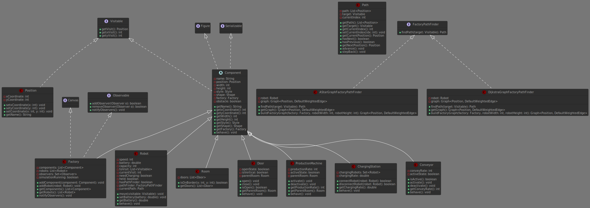

# INF112 - Factory JAVA Project

> team-24 - Maxence GUINZIEMBA-PROKOP & Arsene MALLET

> [!CAUTION]
> The project is mostly complete, to our knowledge no bugs are currently known.

> [!IMPORTANT]
> Une version française de ce fichier est disponible [ici](./README.md)

This project, carried out as part of the object-oriented programming course at *Telecom Paris* (INF112), simulates and implements a factory containing various components, including robots. These robots are tasked with moving autonomously by following a predefined visit list.

## Table of Contents

- [Project Objectives](#project-objectives)
- [Project Organization](#project-organization)
- [Documentation](#documentation)
- [Compilation](#compilation)
  - [Options](#options)
    - [Specific Compilation](#specific-compilation)
    - [Documentation Compilation](#documentation-compilation)
    - [Clean Compilation](#clean-compilation)
- [Running the Simulation](#running-the-simulation)
  - [Options](#options-1)
  - [Scenarios](#scenarios)
    - [Scenario 0](#scenario-0)
    - [Scenario 1](#scenario-1)
    - [Scenario 2](#scenario-2)
- [Logging](#logging)
- [Eclipse Users](#eclipse-users)
  - [Eclipse Configuration Files](#eclipse-configuration-files)
  - [Importing and Running the Simulation](#importing-and-running-the-simulation)

***

## Project Objectives

- [x] R1 - Model a simplified robotic production factory containing the following elements:
  - [x] Factory
  - [x] Robots
  - [x] Robot charging stations
  - [x] Rooms and doors
  - [x] Production machines
  - [x] Conveyors

- [x] R2 - Simulate the behavior of robots transporting produced goods from one place to another in the factory:
  - [x] For each robot, provide a list of positions to visit in the factory, and the robot must move to visit them in succession.
  - [x] Robots must avoid obstacles on their path.
  - [x] Simulate the robots' energy consumption.
  - [x] If a robot reaches a specified minimum energy level (in our case 0), it must move to a charging station and stay there for a certain time to recharge.
  - [x] OPTIONAL: The robot must be able to move diagonally.
  - [x] OPTIONAL: Doors open and close automatically when robots approach.

- [x] R3 - The factory and its simulation must be visualized via a graphical interface.

- [x] R4 - The model (data) must be saveable to disk.

- [x] R5 - The application must handle IO exceptions that may occur during program execution.

- [x] R6-dev - Implement good programming practices discussed in class:
  - [x] Definition and organization of classes.
  - [x] Naming conventions.
  - [x] Comments and code formatting.

- [x] R7-dev - The architecture must follow the MVC (Model-View-Controller) pattern as presented in class.


## Project Organization

The following diagram illustrates the architecture of our project's model (attributes and methods).



For more complete documentation, see [here](#documentation)


## Documentation

A fairly complete project documentation is available [here](./javadoc/index.html) (open this HTML in your favorite web browser). This documentation is generated/compiled automatically using the `javadoc` program (usually available with any Java JDK installation). You may want to recompile it; to do so, see the [documentation compilation](#documentation-compilation) section below.

> [!NOTE]
> The `javadoc` comments in the Java files were mostly generated with the help of an LLM, then reviewed afterwards.


## Compilation

To compile the program, make sure you are in the project's "root" directory (the one containing this file...).

> [!IMPORTANT]
> The project has been compiled using [OpenJDK 23](https://openjdk.org/projects/jdk/23/) and [OpenJDK 24](https://openjdk.org/projects/jdk/24/), any other version (especially < 21) is likely to malfunction.

Then simply run the script:

```bash
./build.sh
```

### Options

#### Specific Compilation

You may want to compile only one project at a time (note: no inter-dependency is handled automatically in this case). You can do this by adding the project name as an argument:

```bash
./build.sh [project_name]
```

Projects in this repo: `canvas`; `robotsim`.

#### Documentation Compilation

You may want to recompile the documentation (automatically generated by `javadoc`). To do so, run the following command:

```bash
./build.sh -d
```

> [!IMPORTANT]
> A *javadoc_build.log* file will be automatically generated with the build information, and placed in the [config](./config) folder.

#### Clean Compilation

If you want to remove files produced by the compilation, add the `-c` argument when running the script:

```bash
./build.sh -c
```


## Running the Simulation

To run the simulation, make sure you have compiled the program and are in the "root" directory (see [this section](#compilation)), then run the launch script:

```bash
./launch.sh
```

### Options

- `-b`: Compile the program before launching the simulation.
- `0`, `1`, `2`: Choose the scenario to launch (only for the main simulation).
- `-graph`: Launch the graph visualization test (GraphVisualizer).
- `-jgrapht`: Launch the JGraphT test (TestJgraphT).

Usage examples:

```bash
./launch.sh -b 1
./launch.sh -graph
./launch.sh -jgrapht
```

> The scenario parameter (`0`, `1`, `2`) is only taken into account for the main simulation.

### Scenarios

#### Scenario 0

A factory composed of 4 rooms, doors, 2 production machines, a conveyor, and 3 charging stations.
This scenario shows the expected behavior for a robot, which visits several components and returns to its base position.


#### Scenario 1

Same factory configuration, but this time with two robots. This scenario shows the operation
of the factory with multiple robots.

>[!CAUTION]
> Collision between robots is not detected; robots are not considered obstacles.


#### Scenario 2

A factory composed of a single room, with many components.
Also composed of a single robot, this scenario shows the robot's movements in a "busy" environment.


## Logging

This project implements a logging system with different severity levels.

The default logger configuration is located in [config/logging.properties](./config/logging.properties),
but can be modified as desired.

## Eclipse Users

### Eclipse Configuration Files

The project contains several Eclipse-specific files:

- `.project`: describes the Eclipse project and its basic settings.
- `.classpath`: lists the source paths and libraries required for compilation.
- `.settings/`: contains advanced settings and preferences for the Eclipse project.
- `.launch/`: contains predefined launch configurations to easily run the simulation.

### Importing and Running the Simulation

To use this project in Eclipse:

1. Import the project folder into Eclipse (`File` > `Import` > `Existing Projects into Workspace`).
2. Eclipse will automatically detect the `.project` and `.classpath` files to configure the project.
3. Launch configurations are available in the `.launch` folder: simply use them to run the simulation without additional setup.
4. Additional settings are managed in the `.settings` folder.

Normally, no manual configuration is required: importing the project should be enough to compile and run the simulation in Eclipse.
